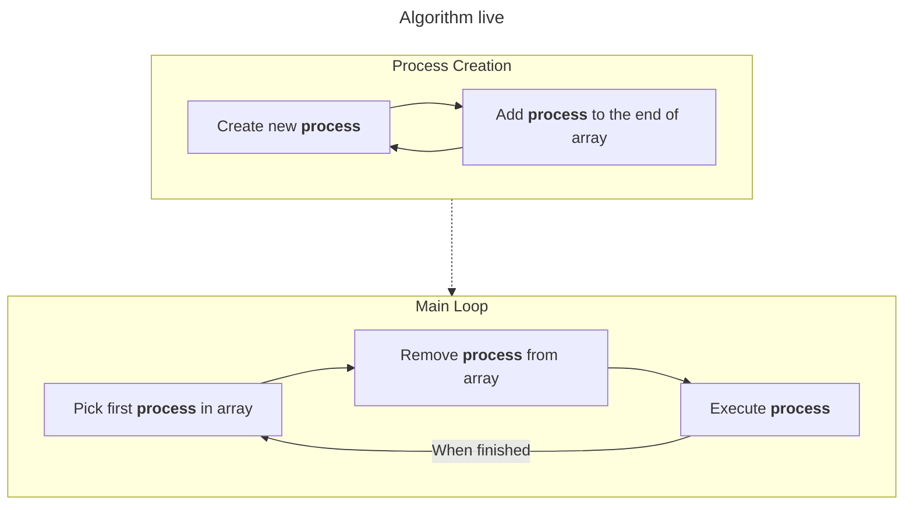

# FCFS algorithm

## FCFS Manager
Manager will create an infinite loop until all requested processes aren't completed.

## Starting manager
On start of simulation user will be asked to choose how many processes are wanted to be simulated.
The user can create more than one simulation.