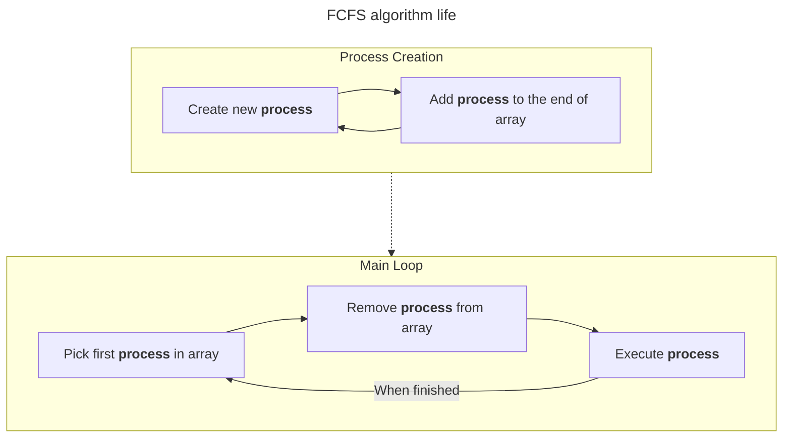
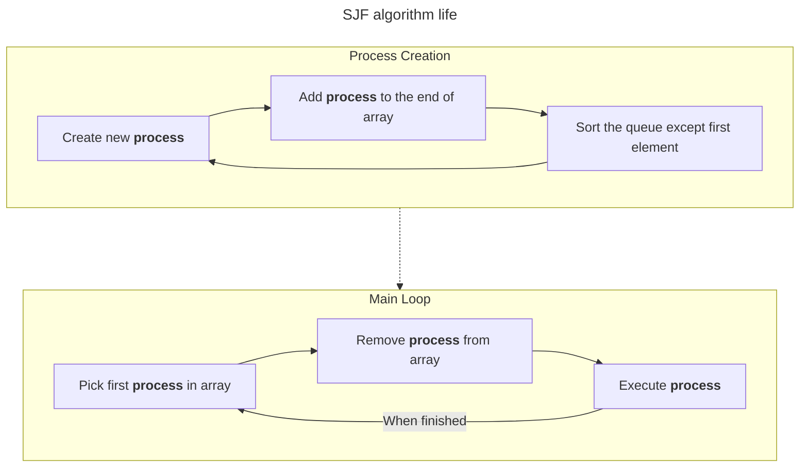
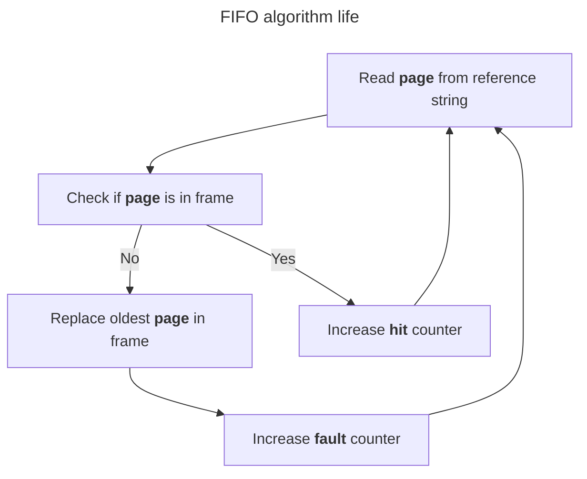
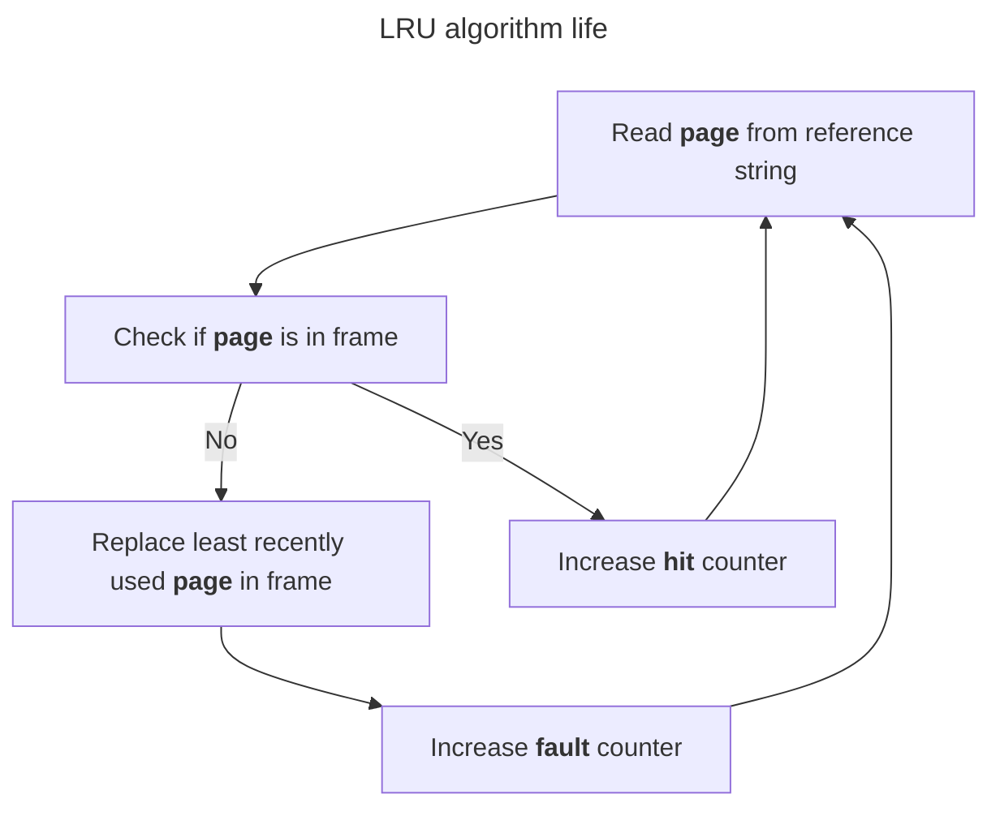

# ProcessSimulation

### Config

- `float_precision` - Precision of the float numbers

## Process scheduling algorithms

### Configuration

Configurable parameters are located in the `config.cfg` file. The following parameters can be changed:

- `process_string`: A string to configure the simulation. Template: < number of processes >:< number of simulations >. 
  Every simulation needs to be seperated by a ';'. Leave the option empty if you want to be asked for the configuration for both algorithms.
  For example "1000:3;2000:4" will create 7 simulations: 3 for 1000 proceses and 4 for 2000 processes.
- `time_range_begin`: From what value should the compilation time begin randomizing
- `time_range_end`: Until what value should the compilation time end randomizing
- `adding_chance`: Chance of adding a new file to the project
- `adding_chance_range`: To expand a possible range of adding chance

### Simulating process scheduling algorithms

There are 2 algorithms to be simulated:

- `FCFS` - First Come, First Served

- `SJF` - Shortest Job First

### Running the simulation

To run the simulation, run the 'main.cpp' file.
You will be asked to configure simulations, you do this, by entering two numbers seperated by ':'.
For example if you type "1000:3 2000:4" there will be created 7 simulations: 3 for 1000 proceses and 4 for 2000
processes.

### Results

Results are stored in the `results` folder. If in your config there are more than 1 simulation for the same number of
processes they will be overwritten.
Result will store the following information:

- `Birth time` - Time when the process was created
- `Starting time` - Time when the process started being processed
- `Ending time` - Time when the process ended being processing
- `Compilation time` - Time the process was being processed

## Page replacement algorithms

### Configuration

Configurable parameters are located in the `config.cfg` file. The following parameters can be changed:

- `frame_size`: Size of the frame
- `reference_string`: Length of the reference string

For randomization of the reference string, you can change the following parameters:

- `randomize_string`: change to `true` if you want to randomize the reference string
- `randomize_string_length`: length of the reference string
- `simulations_count`: number of simulations to be run
- `use_letters`: change to `true` if you want to use letters in the reference string, `capitalize` if you want to use
  capital and lowercase letters, `false` if you want to use only numbers

### Simulating page replacement algorithms

There are 2 algorithms to be simulated:

- `FIFO` - First In First Out

- `LRU` - Least Recently Used

### Running the simulation

To run the simulation, run the 'main.cpp' file.
A reference string is stored in `config.cfg` file.
When randomizing the reference string will only contain numbers from 0 to 9, unless user sets `use_letters` to `true`
in `config.cfg` file.

### Results

Results are stored in the `results` folder.
Result will store the following information:

- `Page life time` - Time the page was in the frame
- `Page fault` - Number of page faults
- `Page hit` - Number of page hits
